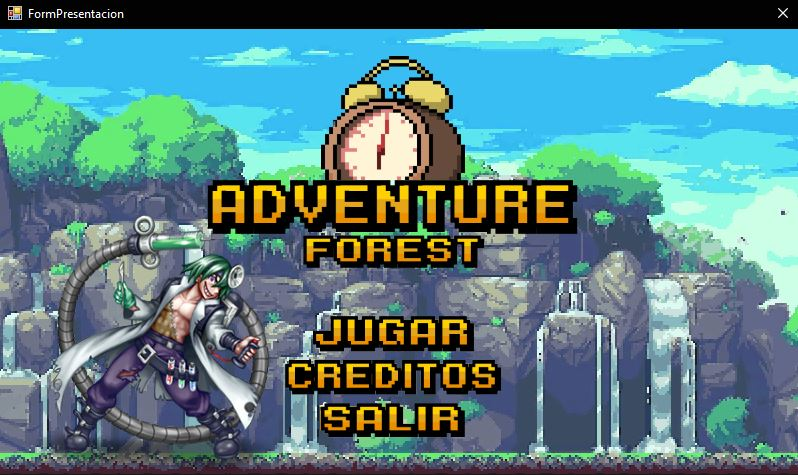

<br />
<div align="center">
  <a href="https://github.com/AbrahamAyquipa/algoritmosEjercicios">
    
  </a>
  <h1 align="center">Final project algorithms</h1>
  <p align="center">
    The following repository will store all project resources without exception. 
  </p>
    
</div>

## Language used: 

## Operating system: 


## Getting Started

You have two options:
* Clone the repo.
  ```sh
  git clone https://github.com/AbrahamAyquipa/final-project-algorithms.git
  ```
* Download it manually. **Code** > **Download ZIP**

## Content

The content specifying the necessary requirements for the game will be attached in the pdf file.

## contributors

- [@PANDA](https://github.com/PANDA00007)
- [@AndresCRs](https://github.com/AndresCRs)
